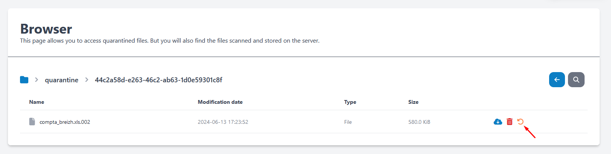

# Browser

## Libérer un fichier en quarantaine
Si vous souhaitez libérer un fichier présent dans la zone en quarantaine d'un utilisateur accédez au **Browser** puis sélectionnez le dossier **quarantine** puis recherchez **l'utilisateur** qui doit récupérer son fichier.  
Vous avez ensuite accès à la liste des fichiers disponibles dans la zone de quarantaine de l'utilisateur. Cliquez simplement sur le bouton de "release" correspondant au fichier.

!!! bug "Zone de quarantaine"

    La zone de quarantaine contient des fichiers qui ont été détecté comme malveillant par les antivirus !  
    Agissez en conséquence.