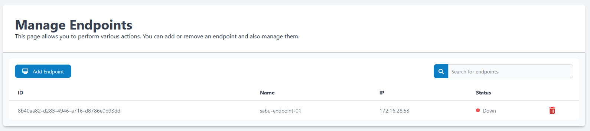
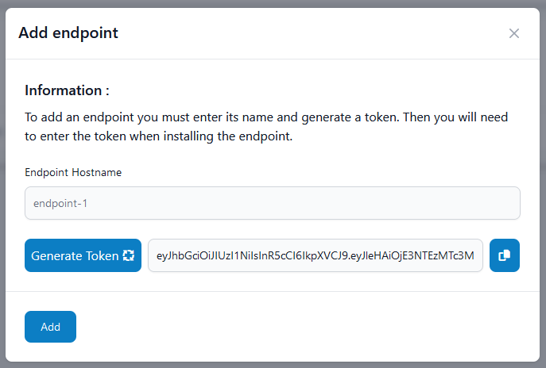

# Endpoints

## Ajouter un endpoint
Pour pouvoir ajouter un endpoint, allez dans **Endpoint** puis cliquez sur **Add endpoint**.  
(Si vous souhaitez supprimer un endpoint, cliquez sur la poubelle rouge)

!!! abstract "Information à renseigner"

    - Renseigner le **nom de l'endpoint**
    - Générer le **token d'authentification** puis gardez-le, il vous sera utile lors de l'installation de l'endpoint

