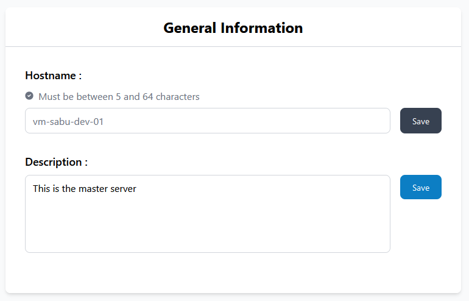
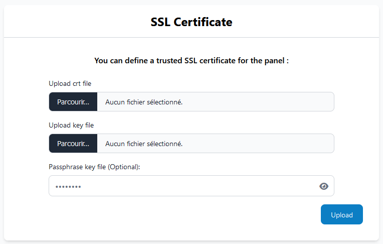
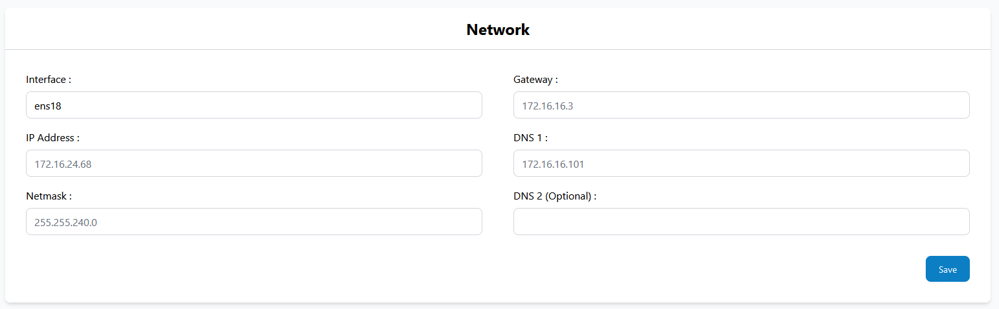

# Server

## Modifier le nom du serveur
Pour changer le nom du serveur vous devez aller dans **Server** puis **Settings**.  
Ensuite vous avez une section **General information** où vous trouvez un emplacement pour pouvoir changer le nom du serveur. Vous pouvez aussi ajouter une description si vous le souhaitez.

## Modifier le certificat SSL
Pour pouvoir changer le certificat SSL par défaut, vous devez aller dans **Server** puis **Settings**.  
Ensuite vous avez une section **SSL Certificate** où vous pouvez envoyer votre nouveau certificat SSL.

## Modifier les paramètres réseau
Pour modifier les paramètres réseau allez dans **Server** puis **Settings**.  
Ensuite il y a une section **Network** prévu à cet effet où il est possible de modifier les informations réseau.

