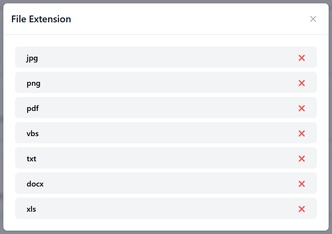

# Settings

## Ajouter une extension
!!! info "Information"

    Pour effectuer des scans, il est nécessaire d'ajouter les extensions de fichiers appropriées. Les fichiers dont les extensions ne sont pas ajoutées ne pourront pas être analysés.

Pour pouvoir ajouter une extension, allez dans **Settings** puis dans la section **File Extension** entrer l'extension de fichier que vous souhaitez ajouter et cliquer sur le "+" ou alors appuyer sur la touche "Entrer" de votre clavier.

Pour voir les extensions ajoutées, cliquez sur **Show** :

## Configurer la maintenance
!!! info "Information"

    Une maintenance est prévue pour mettre à jour automatiquement le système SABU.  
    Par défaut la maintenance est programmée tous les jours à 2h.

Pour configurer la maintenance, il vous suffit de choisir la fréquence des mises à jour et de définir l'heure à laquelle elles doivent être effectuées.

## Configurer la rétention
!!! info "Information"

    La rétention des fichiers détermine la durée pendant laquelle les fichiers sont conservés dans l'espace de stockage des utilisateurs.  
    Par défaut la rétention est configurée sur 30 jours.

Pour configurer la rétention, il suffit de clisser le curseur.
