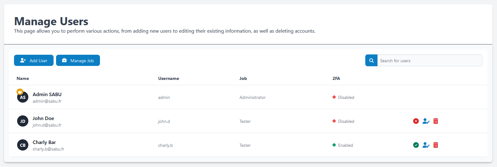
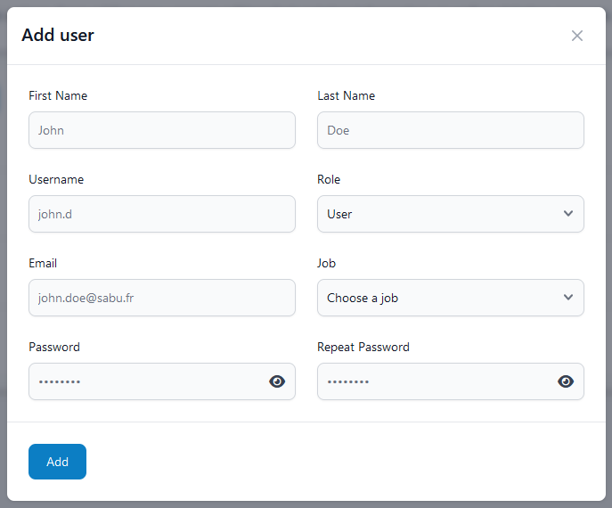
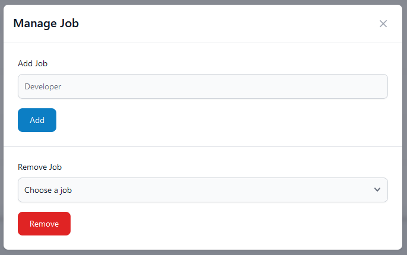

# Users

## Gérer les utilisateurs
Pour gérer les utilisateurs vous devez aller dans **Users**.

!!! tip

    Vous pouvez **éditer** un utilisateur en cliquant sur le bouton bleu.  
    Pour **supprimer** un utilisateur cliquez sur la poubelle rouge.  
    Pour **activer** ou **désactiver** un utilisateur cliquez sur le dernier bouton.

### Ajouter un utilisateur
Cliquer sur **Add User**.
!!! warning "Prérequis"

    Vous devez avoir créé au moins un métier avant de créer un utilisateur.

!!! abstract "Informations à renseigner"

    - Nom, Prénom, Email
    - Nom d'utilisateur
    - Son rôle (Admin ou User)
    - Sélectionnez son métier (que vous avez créé précédemment)
    - Renseigner son mot de passe et confirmez-le

## Gérer les métiers
Pour pouvoir générer les métiers vous devez cliquer sur **Manage Job** puis ensuite vous pouvez soit **ajouter** ou **supprimer** un métier.

